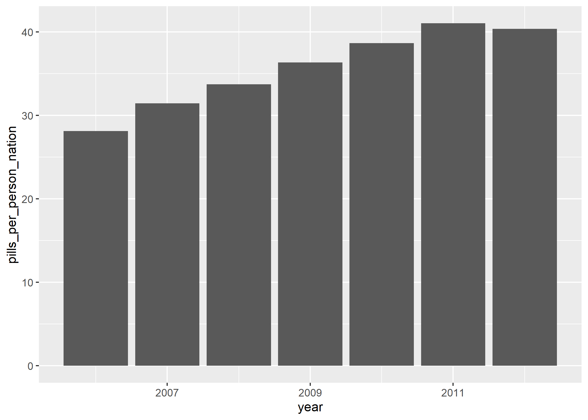
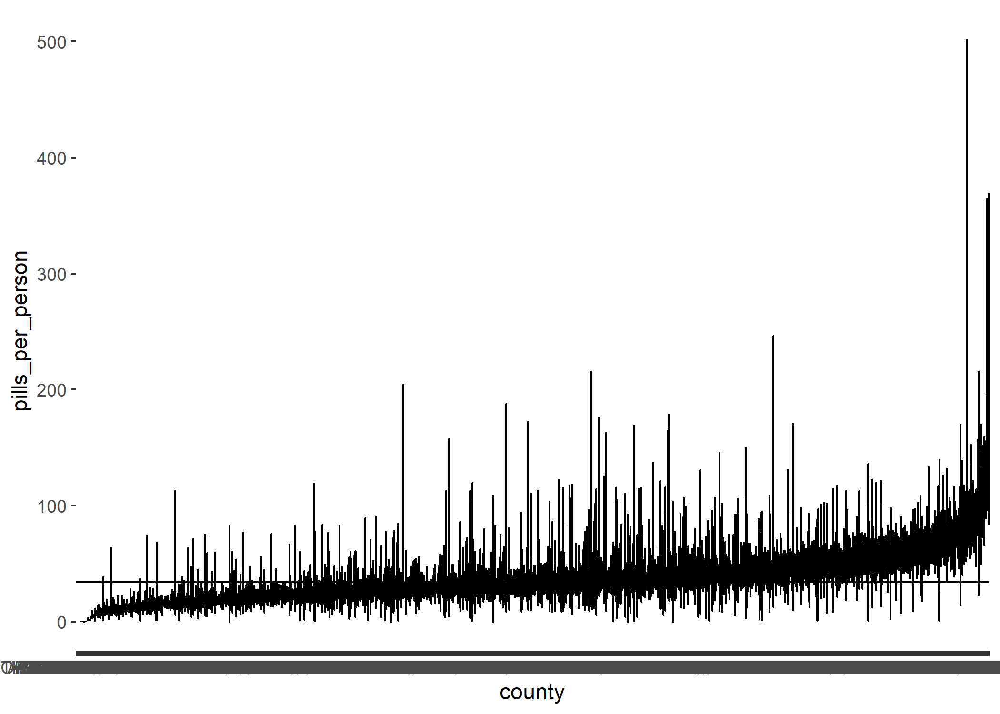
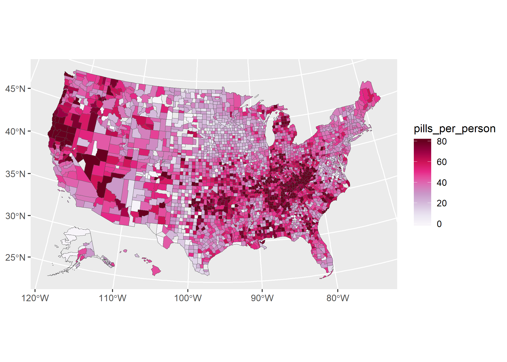
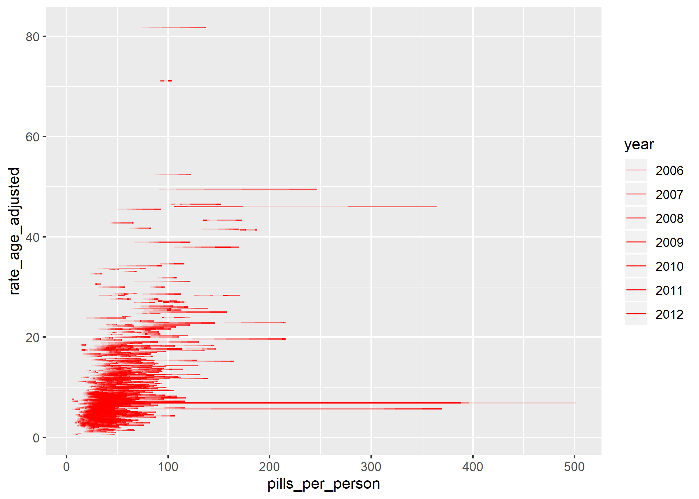

Opioid Epidemic - Part 2
================
Kate Ham
2020-02-13

  - [Annual number of opioid pills shipped to
    counties](#annual-number-of-opioid-pills-shipped-to-counties)
  - [Opioid pills per person by
    county](#opioid-pills-per-person-by-county)
  - [EDA](#eda)
      - [Opioid pills per person for the entire
        country](#opioid-pills-per-person-for-the-entire-country)
      - [Distribution of opioid pills per person by
        county](#distribution-of-opioid-pills-per-person-by-county)
      - [Geographic distribution of opioid pills per person by
        county](#geographic-distribution-of-opioid-pills-per-person-by-county)
      - [Correlation between opioid pills per person and opioid overdose
        deaths](#correlation-between-opioid-pills-per-person-and-opioid-overdose-deaths)

``` r
# Libraries
library(tidyverse)
library(sf)
library(dcl)

# Parameters
  # Key for Washington Post ARCOS API
key <- "WaPo"
  # Washington Post API query for annual summarized pill totals by county
wp_county_annual <- 
  str_glue(
    "https://arcos-api.ext.nile.works/v1/combined_county_annual?key={key}"
  )
  # Washington Post API query for county populations
wp_county_population <- 
  str_glue("https://arcos-api.ext.nile.works/v1/county_population?key={key}")
  # Files for answers
file_answers_1 <- "../../data/opioids/answers_1.rds"
file_answers_2 <- "../../data/opioids/answers_2.rds"

#===============================================================================

# Read in opioid overdose data from Part 1
opioid_overdose <- read_rds(file_answers_1)$q3

# Read in answers
answers <- read_rds(file_answers_2)
```

## Annual number of opioid pills shipped to counties

**q1.1** Use `jsonlite::fromJSON()` and the API query `wp_county_annual`
to download the total annual number of opioid pills shipped to counties
and create a tibble `q1.1` with the following variables:

  - `county`
  - `state`
  - `fips`
  - `year`
  - `pills`

Store `fips` integers. Sort your data by `fips` and `year`.

Notes:

  - `jsonlite::fromJSON()` returns a *data.frame* and not a *tibble*.
  - The [data
    dictionary](https://github.com/wpinvestigative/arcos-api/blob/master/data/data_dictionary.csv)
    describes most of the relevant variables.

<!-- end list -->

``` r
q1.1 <- 
  wp_county_annual %>% 
  jsonlite::fromJSON() %>% 
  as_tibble() %>% 
  transmute(
    county = `BUYER_COUNTY`,
    state = `BUYER_STATE`,
    fips = as.integer(countyfips),
    year,
    pills = `DOSAGE_UNIT`
  ) %>% 
  arrange(fips, year)


# Print results
if (exists("q1.1")) q1.1
```

    ## # A tibble: 21,597 x 5
    ##    county  state  fips  year   pills
    ##    <chr>   <chr> <int> <int>   <dbl>
    ##  1 AUTAUGA AL     1001  2006 2277140
    ##  2 AUTAUGA AL     1001  2007 2595590
    ##  3 AUTAUGA AL     1001  2008 2817500
    ##  4 AUTAUGA AL     1001  2009 3120850
    ##  5 AUTAUGA AL     1001  2010 3174140
    ##  6 AUTAUGA AL     1001  2011 3525120
    ##  7 AUTAUGA AL     1001  2012 3758130
    ##  8 BALDWIN AL     1003  2006 6353798
    ##  9 BALDWIN AL     1003  2007 7666160
    ## 10 BALDWIN AL     1003  2008 8620950
    ## # ... with 21,587 more rows

``` r
# Compare result with answer
if (exists("q1.1")) compare(answers$q1.1, q1.1)
```

    ## TRUE

**q1.2** Look at the data in `q1.1` and assess its quality. If there are
any problems, fix them, and store the result in `q1.2`. Explain what
this data contains.

``` r
q1.2 <- 
  q1.1 %>% 
  drop_na()
```

There are many NAs but they are for places without FIPS codes because
they are US territories but not states.

## Opioid pills per person by county

The population of U.S. counties varies widely, from sparsely populated
rural counties to densely populated urban counties. We want to
understand the number of opioid pills shipped to a county relative to
its population. For this purpose, we need the populations of the
counties for the years 2006 – 2012.

The U.S. Census Bureau makes population estimates between the decennial
censuses, and these are available through
[APIs](https://www.census.gov/data/developers/data-sets/popest-popproj/popest.html).

**q2.1** Use the Census Bureau API to download the Vintage 2018 county
population estimates and create a tibble `q2.1` with the variables:

  - `name`
  - `fips`
  - `year`
  - `population`

Notes:

  - Filter your tibble to only include population estimates for July 1.
  - Filter your tibble to the years in `q1.2`.
  - Store `fips` and `year` as integers, `population` as doubles.
  - Sort your data by fips`and`year\`.

Hints:

  - If you click on the *Examples and Supported Geographies* link under
    the tab for Vintage 2018 on the APIs page above, you’ll find links
    to examples and the variables to include in your query. You can omit
    the `key` field.
  - `jsonlite::fromJSON()` will return a matrix with the column names
    stored in the first row. You may find `janitor::row_to_names()`
    helpful in working with the resulting tibble.

<!-- end list -->

``` r
request_post2010 <- 
  "https://api.census.gov/data/2018/pep/population?get=GEONAME,COUNTY,DATE_CODE,DATE_DESC,POP&for=county:*"

q2.1 <- 
  request_post2010 %>% 
  jsonlite::fromJSON() %>% 
  as_tibble() %>% 
  janitor::row_to_names(row_number = 1) %>% 
  filter(str_detect(`DATE_DESC`, "^7/1/.*")) %>% 
  transmute(
    name = `GEONAME`,
    fips = str_c(state, county) %>% as.integer(),
    year = str_extract(`DATE_DESC`, "20\\d\\d") %>% as.integer,
    population = as.double(`POP`)
  ) %>% 
  filter(year <= 2012) %>% 
  arrange(fips, year)

# Print results
if (exists("q2.1")) q2.1
```

    ## # A tibble: 9,660 x 4
    ##    name                     fips  year population
    ##    <chr>                   <int> <int>      <dbl>
    ##  1 Autauga County, Alabama  1001  2010      54754
    ##  2 Autauga County, Alabama  1001  2011      55208
    ##  3 Autauga County, Alabama  1001  2012      54936
    ##  4 Baldwin County, Alabama  1003  2010     183111
    ##  5 Baldwin County, Alabama  1003  2011     186540
    ##  6 Baldwin County, Alabama  1003  2012     190143
    ##  7 Barbour County, Alabama  1005  2010      27330
    ##  8 Barbour County, Alabama  1005  2011      27350
    ##  9 Barbour County, Alabama  1005  2012      27174
    ## 10 Bibb County, Alabama     1007  2010      22872
    ## # ... with 9,650 more rows

``` r
# Compare result with answer
if (exists("q2.1")) compare(answers$q2.1, q2.1)
```

    ## TRUE

**q2.2** The Vintage 2018 estimates only include population estimates
since the last decennial census (2010). To get population data from
before 2010, we’ll need to use the 2000-2010 Intercensal county
population estimates. You can find examples under the *2000-2010
Intercensal* tab.

Use the API to download the 2000-2010 Intercensal county population
estimates and create a tibble `q2.2` with the variables:

  - `name`
  - `fips`
  - `year`
  - `population`

Notes:

  - Filter your tibble to only include population estimates for July 1.
  - Limit your data to the years in `q1.2`.
  - Store `fips` and `year` as integers, `population` as doubles.
  - Sort your data by `fips` and `year`.

The hints from **q2.1** apply.

``` r
request_pre2010 <- 
  "https://api.census.gov/data/2000/pep/int_population?get=GEONAME,COUNTY,DATE_,DATE_DESC,POP&for=county:*"

q2.2 <- 
  request_pre2010 %>% 
  jsonlite::fromJSON() %>% 
  as_tibble() %>% 
  janitor::row_to_names(row_number = 1) %>% 
  filter(str_detect(`DATE_DESC`, "^7/1/.*")) %>% 
  transmute(
    name = `GEONAME`,
    fips = str_c(state, county) %>% as.integer(),
    year = str_extract(`DATE_DESC`, "20\\d\\d") %>% as.integer,
    population = as.double(`POP`)
  ) %>% 
  filter(year >= 2006) %>% 
  arrange(fips, year)

# Print results
if (exists("q2.2")) q2.2
```

    ## # A tibble: 12,884 x 4
    ##    name                     fips  year population
    ##    <chr>                   <int> <int>      <dbl>
    ##  1 Autauga County, Alabama  1001  2006      51328
    ##  2 Autauga County, Alabama  1001  2007      52405
    ##  3 Autauga County, Alabama  1001  2008      53277
    ##  4 Autauga County, Alabama  1001  2009      54135
    ##  5 Baldwin County, Alabama  1003  2006     168121
    ##  6 Baldwin County, Alabama  1003  2007     172404
    ##  7 Baldwin County, Alabama  1003  2008     175827
    ##  8 Baldwin County, Alabama  1003  2009     179406
    ##  9 Barbour County, Alabama  1005  2006      27861
    ## 10 Barbour County, Alabama  1005  2007      27757
    ## # ... with 12,874 more rows

``` r
# Compare result with answer
if (exists("q2.2")) compare(answers$q2.2, q2.2)
```

    ## TRUE

**q2.3** Combine `q2.1` and `q2.2` to create a single tibble with
population data for all the relevant years. Store the result in `q2.3`
and sort by fips and year.

``` r
q2.3 <- 
  bind_rows(q2.1, q2.2) %>% 
  arrange(fips, year)

# Print results
if (exists("q2.3")) q2.3
```

    ## # A tibble: 22,544 x 4
    ##    name                     fips  year population
    ##    <chr>                   <int> <int>      <dbl>
    ##  1 Autauga County, Alabama  1001  2006      51328
    ##  2 Autauga County, Alabama  1001  2007      52405
    ##  3 Autauga County, Alabama  1001  2008      53277
    ##  4 Autauga County, Alabama  1001  2009      54135
    ##  5 Autauga County, Alabama  1001  2010      54754
    ##  6 Autauga County, Alabama  1001  2011      55208
    ##  7 Autauga County, Alabama  1001  2012      54936
    ##  8 Baldwin County, Alabama  1003  2006     168121
    ##  9 Baldwin County, Alabama  1003  2007     172404
    ## 10 Baldwin County, Alabama  1003  2008     175827
    ## # ... with 22,534 more rows

``` r
# Compare result with answer
if (exists("q2.3")) compare(answers$q2.3, q2.3)
```

    ## TRUE

**q2.4** Assess its quality of `q2.3`. Are all of the counties in `q1.2`
in `q2.3`?

``` r
q2.3 %>% 
  filter_all(any_vars(is.na(.)))
```

    ## # A tibble: 0 x 4
    ## # ... with 4 variables: name <chr>, fips <int>, year <int>, population <dbl>

``` r
length(setdiff(q2.3$fips, q1.2$fips))
```

    ## [1] 187

``` r
setdiff(q1.2$fips, q2.3$fips)
```

    ## integer(0)

There are 187 counties missing from q1.2.

**q2.5** The Washington Post reporters compiled their own county
population data. Use `jsonlite::fromJSON()` and the API query
`wp_county_population` to download their county populations estimates,
creating a tibble `q2.5` with the following variables:

  - `county` (`BUYER_COUNTY`)
  - `state` (`BUYER_STATE`)
  - `name`
  - `fips`
  - `year`
  - `population`

Store `fips` and `year` as integers and `population` as a double.

``` r
q2.5 <-
  wp_county_population %>% 
  jsonlite::fromJSON() %>% 
  as_tibble() %>% 
  transmute(
    county = `BUYER_COUNTY`,
    state = `BUYER_STATE`,
    name = `NAME`,
    fips = as.integer(countyfips),
    year,
    population
  ) %>% 
  arrange(fips, year)

# Print results
if (exists("q2.5")) q2.5
```

    ## # A tibble: 22,001 x 6
    ##    county  state name                     fips  year population
    ##    <chr>   <chr> <chr>                   <int> <int>      <int>
    ##  1 AUTAUGA AL    Autauga County, Alabama  1001  2006      51328
    ##  2 AUTAUGA AL    Autauga County, Alabama  1001  2007      52405
    ##  3 AUTAUGA AL    Autauga County, Alabama  1001  2008      53277
    ##  4 AUTAUGA AL    Autauga County, Alabama  1001  2009      49584
    ##  5 AUTAUGA AL    Autauga County, Alabama  1001  2010      53155
    ##  6 AUTAUGA AL    Autauga County, Alabama  1001  2011      53944
    ##  7 AUTAUGA AL    Autauga County, Alabama  1001  2012      54590
    ##  8 BALDWIN AL    Baldwin County, Alabama  1003  2006     168121
    ##  9 BALDWIN AL    Baldwin County, Alabama  1003  2007     172404
    ## 10 BALDWIN AL    Baldwin County, Alabama  1003  2008     175827
    ## # ... with 21,991 more rows

``` r
# Compare result with answer
if (exists("q2.5")) compare(answers$q2.5, q2.5)
```

    ## TRUE

**q2.6** Assess the quality of the data in `q2.5`. Then, compare the
Washington Post’s population estimates (`q2.5`) with the Census Bureau’s
(`q2.3`). If they differ, which dataset do you think you should use?

``` r
q2.5 %>% 
  filter_all(any_vars(is.na(.)))
```

    ## # A tibble: 28 x 6
    ##    county                state name   fips  year population
    ##    <chr>                 <chr> <chr> <int> <int>      <int>
    ##  1 PRINCE OF WALES HYDER AK    <NA>   2198  2006       5574
    ##  2 PRINCE OF WALES HYDER AK    <NA>   2198  2007       5457
    ##  3 PRINCE OF WALES HYDER AK    <NA>   2198  2008       5448
    ##  4 PRINCE OF WALES HYDER AK    <NA>   2198  2009         NA
    ##  5 PRINCE OF WALES HYDER AK    <NA>   2198  2010         NA
    ##  6 PRINCE OF WALES HYDER AK    <NA>   2198  2011         NA
    ##  7 PRINCE OF WALES HYDER AK    <NA>   2198  2012         NA
    ##  8 SKAGWAY HOONAH ANGOON AK    <NA>   2232  2006        946
    ##  9 SKAGWAY HOONAH ANGOON AK    <NA>   2232  2007        955
    ## 10 SKAGWAY HOONAH ANGOON AK    <NA>   2232  2008        967
    ## # ... with 18 more rows

``` r
length(setdiff(q2.5$fips, q2.3$fips))
```

    ## [1] 2

``` r
length(setdiff(q2.3$fips, q2.5$fips))
```

    ## [1] 82

There are 28 rows with missing data in q2.5, and 15 of them are missing
population data.

There are 2 counties missing from q2.3, compared with 82 counties
missing from q2.5. Therefore it makes most sense to use q2.3.

**q3** Join `q1.2` with your choice of a population dataset from
**q2.6** and create a tibble `q3` with variables:

  - `county`
  - `state`
  - `name`
  - `fips`
  - `year`
  - `pills`
  - `population`
  - `pills_per_person`

Sort by `fips` and `year`.

``` r
q3 <- 
  q1.2 %>% 
  left_join(q2.3, by = c("fips", "year")) %>% 
  transmute(
    county,
    state,
    name,
    fips,
    year,
    pills,
    population,
    pills_per_person = pills / population
  ) %>% 
  arrange(fips, year)

# Print results
if (exists("q3")) q3
```

    ## # A tibble: 21,002 x 8
    ##    county  state name              fips  year  pills population pills_per_person
    ##    <chr>   <chr> <chr>            <int> <int>  <dbl>      <dbl>            <dbl>
    ##  1 AUTAUGA AL    Autauga County,~  1001  2006 2.28e6      51328             44.4
    ##  2 AUTAUGA AL    Autauga County,~  1001  2007 2.60e6      52405             49.5
    ##  3 AUTAUGA AL    Autauga County,~  1001  2008 2.82e6      53277             52.9
    ##  4 AUTAUGA AL    Autauga County,~  1001  2009 3.12e6      54135             57.6
    ##  5 AUTAUGA AL    Autauga County,~  1001  2010 3.17e6      54754             58.0
    ##  6 AUTAUGA AL    Autauga County,~  1001  2011 3.53e6      55208             63.9
    ##  7 AUTAUGA AL    Autauga County,~  1001  2012 3.76e6      54936             68.4
    ##  8 BALDWIN AL    Baldwin County,~  1003  2006 6.35e6     168121             37.8
    ##  9 BALDWIN AL    Baldwin County,~  1003  2007 7.67e6     172404             44.5
    ## 10 BALDWIN AL    Baldwin County,~  1003  2008 8.62e6     175827             49.0
    ## # ... with 20,992 more rows

## EDA

### Opioid pills per person for the entire country

**q4** Calculate the average number of opioid pills shipped per person,
per year, for the entire country. Visualize the result. What conclusions
can you draw?

``` r
q3 %>% 
  group_by(year) %>% 
  summarise(
    pills_per_person_nation = sum(pills) / sum(population)
  ) %>% 
  ggplot(aes(year, pills_per_person_nation)) +
  geom_col()
```


The national number of pills per person increased by about 50% during
the second half of the 2000s.

### Distribution of opioid pills per person by county

**q5** Visualize the distribution of `pills_per_person` in `q3`. What
conclusions can you draw?

``` r
q3 %>% 
  mutate(county = fct_reorder(county, pills_per_person)) %>% 
  ggplot(aes(county, pills_per_person)) +
  geom_line() +
  geom_hline(aes(yintercept = median(pills_per_person)))
```


Most counties have about 33 pills per person, though a few hundred
counties have at least 75 pills per person.

### Geographic distribution of opioid pills per person by county

**q6** Use the data in `q3` to visualize the number of pills per person
on a map. You can use `ussf::boundaries()` to get county and state
boundaries. What conclusions can you draw?

``` r
county_boundaries <- 
  ussf::boundaries(geography = "county") %>% 
  mutate(fips = as.integer(GEOID)) %>% 
  select(fips, geometry)

state_boundaries <- 
  ussf::boundaries(geography = "state")

q3 %>% 
  left_join(county_boundaries, by = "fips") %>% 
  mutate(pills_per_person = pmin(80, pills_per_person)) %>% 
  ggplot() +
  geom_sf(aes(fill = pills_per_person, geometry = geometry), size = 0.001) +
  geom_sf(data = state_boundaries, color = "grey25", fill = NA, size = 0.2) +
  scale_fill_gradientn(
    colors = RColorBrewer::brewer.pal(9, "PuRd"),
    limits = c(0, 80),
    breaks = seq(0, 80, 20),
    na.value = "grey75"
  )
```


The regions with highest opioid pills per person seem clustered in the
Northwest and the Midwest.

### Correlation between opioid pills per person and opioid overdose deaths

**q7** `opioid_overdose` contains the opioid overdose data from Part 1.
Visualize counties’ opioid overdose death rates as a function of the
number of opioid pills distributed per person. What conclusions can you
draw?

``` r
opioid_overdose %>% 
  left_join(q3, by = "fips") %>% 
  drop_na() %>% 
  ggplot(aes(pills_per_person, rate_age_adjusted, group = fips, alpha = year)) +
  geom_line(color = "red")
```


The death rate climbs rapidly based on the number of pills per person.

The reading for this challenge is *Census Bureau APIs*.

After you finish this task, please complete [Notes on Task -
Part 1](https://forms.gle/NdSN5Tye6EtMiXAm8).
