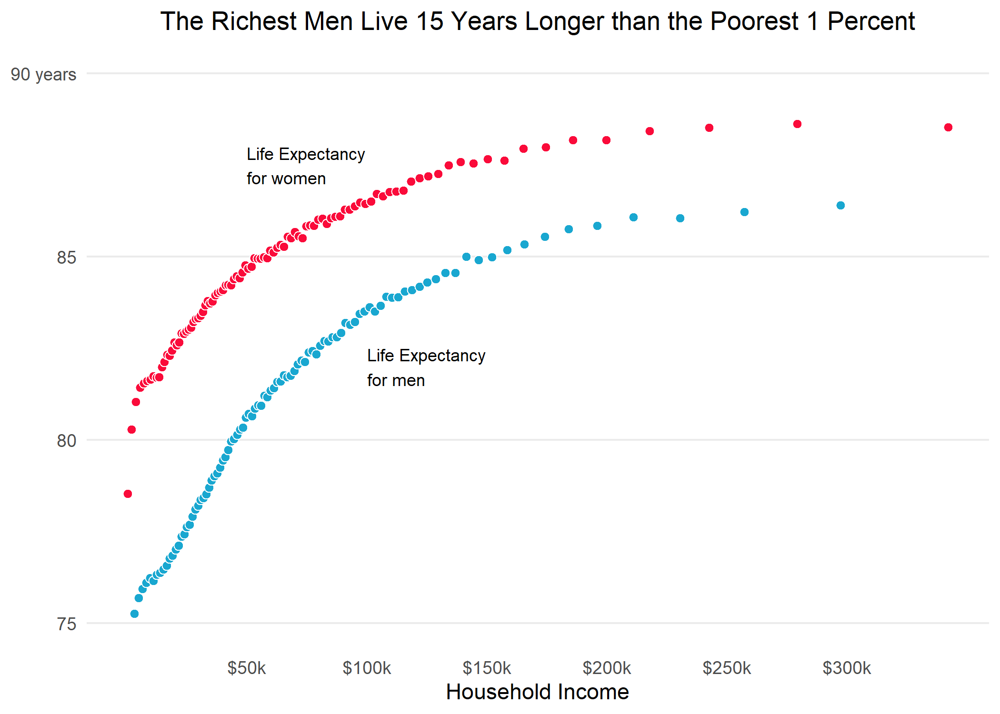
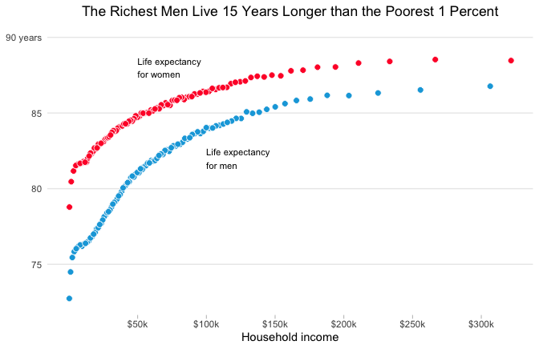
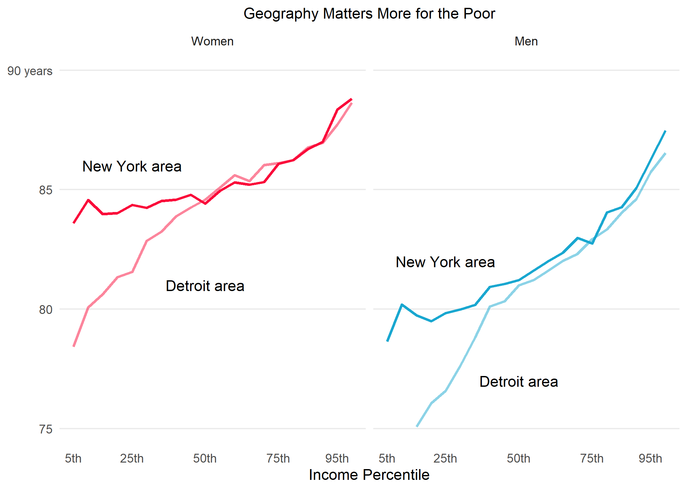
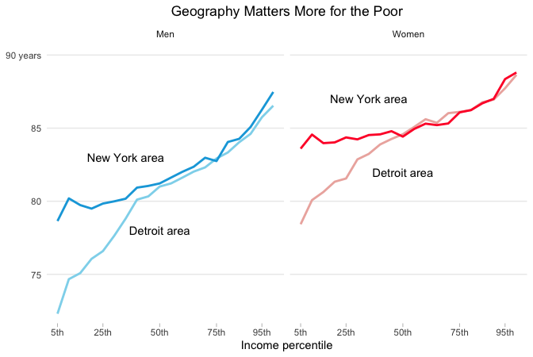

Health inequality
================
Kate Ham
2020-02-25

  - [Life expectancy of men and women by
    income](#life-expectancy-of-men-and-women-by-income)
  - [Life expectancy in New York and
    Detroit](#life-expectancy-in-new-york-and-detroit)

``` r
# Libraries
library(tidyverse)
library(dcl)

# Parameters
  # URL for data with national life expectancy estimates (pooling 2001-14) for
  # men and women, by income percentile
url_table_1 <- "https://healthinequality.org/dl/health_ineq_online_table_1.csv"
  # URL for data with commuting zone life expectancy estimates for men and
  # women, by income ventile
url_table_7 <- "https://healthinequality.org/dl/health_ineq_online_table_7.csv"
  # Commuting zone names
cznames <- c(
  "Detroit",
  "New York City"
)
  # File for answers
file_answers <- "../../data/health-inequality/answers.rds"

#===============================================================================

# Read in answers
answers <- read_rds(file_answers)

# Set seed
set.seed(451)
```

Raj Chetty and his research collaborators used income data from 1.4
billion de-identified tax records and mortality data from the Social
Security Administration to estimate the life expectancy in the United
States at 40 years of age by household income, sex and geographic area
\[1\]. The researchers have a [website](https://healthinequality.org/)
from which the [data](https://healthinequality.org/data/) from their
report is available for download.

On the same day that the researchers’ paper was published, The New York
Times published a story with visualizations of their data

  - Irwin N, Quoctrung B. [The Rich Live Longer Everywhere. For the
    Poor, Geography
    Matters](https://www.nytimes.com/interactive/2016/04/11/upshot/for-the-poor-geography-is-life-and-death.html).
    New York Times, 2016-04-11.

This challenge is to recreate two of the data visualizations from the
original data. This will largely be recall of techniques you’ve already
learned, through the plots will require some methods you haven’t seen
before. The solutions in `answers` are example solutions. They do not
recreate the original visualizations exactly, though that is possible.

Here are links to relevant [ggplot2
documentation](http://ggplot2.tidyverse.org/reference/index.html) at
[tidyverse.org](http://tidyverse.org/):

  - [`theme_*()`](http://ggplot2.tidyverse.org/reference/ggtheme.html)
    for controlling how your plot appears.
  - [`theme()`](http://ggplot2.tidyverse.org/reference/theme.html) to
    modify components of the default or other themes.
  - [`geom_point()`](https://ggplot2.tidyverse.org/reference/geom_point.html)
    to control the appearance of points through aesthetics.
  - You can customize the labels for the axis tick marks by providing
    functions to the `labels =` argument of
    [`scale_*_continuous()`](http://ggplot2.tidyverse.org/reference/scale_continuous.html).
    These functions should take as their argument the number for the
    axis tick mark, and they should return the string to use.
  - [`annotate()`](https://ggplot2.tidyverse.org/reference/annotate.html)
    for annotating a plot.
  - [`scale_*_manual()`](http://ggplot2.tidyverse.org/reference/scale_manual.html)
    for customizing colors.

## Life expectancy of men and women by income

**q1** Read in the CSV data from at the URL `url_table_1` and recreate
the scatterplot from the New York Times story in presentation quality.
Take a look at the
[Readme](https://healthinequality.org/dl/health_ineq_online_table_1_readme.pdf)
file for this data, which describes the variables. The Times plotted
race-adjusted life expectancy as a function of the mean household income
at age 40.

``` r
q1 <- 
  url_table_1 %>% 
  read_csv() %>% 
  filter(hh_inc < 350000) %>% 
  ggplot(aes(hh_inc, le_agg, group = gnd, fill = gnd)) +
  geom_point(shape = 21, color = "white", size = 2) +
  annotate(
    geom = "text",
    label = "Life Expectancy\nfor women",
    hjust = "left",
    vjust = "top",
    x = 50000,
    y = 88,
    size = 3
  ) +
  annotate(
    geom = "text",
    label = "Life Expectancy\nfor men",
    hjust = "left",
    vjust = "top",
    x = 100000,
    y = 82.5,
    size = 3
  ) +
  scale_x_continuous(
    breaks = seq(50000, 300000, 50000),
    minor_breaks = NULL,
    labels = scales::label_dollar(accuracy = 2, scale = 1/1000, suffix = "k")
  ) +
  scale_y_continuous(
    breaks = c(75, 80, 85, 90),
    limits = c(75, 90),
    labels = c(75, 80, 85, "90 years"),
    minor_breaks = NULL
  ) +
  scale_fill_manual(values = c("F" = "#FA0B3A", "M" = "#19A7D0")) +
  labs(
    title = "The Richest Men Live 15 Years Longer than the Poorest 1 Percent",
    x = "Household Income",
    y = NULL
  ) +
  theme_minimal() +
  theme(
    legend.position = "null",
    text = element_text(family = "Franklin Gothic Book"),
    plot.title = element_text(size = 13, hjust = 0.5),
    panel.grid.major.x = element_blank()
  )
```

    ## Parsed with column specification:
    ## cols(
    ##   gnd = col_character(),
    ##   pctile = col_double(),
    ##   count = col_double(),
    ##   hh_inc = col_double(),
    ##   hh_inc_age40 = col_double(),
    ##   le_agg = col_double(),
    ##   le_raceadj = col_double(),
    ##   sd_le_agg = col_double(),
    ##   sd_le_raceadj = col_double()
    ## )

``` r
# Print results
if (exists("q1")) q1
```

    ## Warning: Removed 2 rows containing missing values (geom_point).

    ## Warning in grid.Call(C_stringMetric, as.graphicsAnnot(x$label)): font family not
    ## found in Windows font database
    
    ## Warning in grid.Call(C_stringMetric, as.graphicsAnnot(x$label)): font family not
    ## found in Windows font database

    ## Warning in grid.Call(C_textBounds, as.graphicsAnnot(x$label), x$x, x$y, : font
    ## family not found in Windows font database

    ## Warning in grid.Call(C_stringMetric, as.graphicsAnnot(x$label)): font family not
    ## found in Windows font database

    ## Warning in grid.Call(C_textBounds, as.graphicsAnnot(x$label), x$x, x$y, : font
    ## family not found in Windows font database
    
    ## Warning in grid.Call(C_textBounds, as.graphicsAnnot(x$label), x$x, x$y, : font
    ## family not found in Windows font database
    
    ## Warning in grid.Call(C_textBounds, as.graphicsAnnot(x$label), x$x, x$y, : font
    ## family not found in Windows font database
    
    ## Warning in grid.Call(C_textBounds, as.graphicsAnnot(x$label), x$x, x$y, : font
    ## family not found in Windows font database
    
    ## Warning in grid.Call(C_textBounds, as.graphicsAnnot(x$label), x$x, x$y, : font
    ## family not found in Windows font database
    
    ## Warning in grid.Call(C_textBounds, as.graphicsAnnot(x$label), x$x, x$y, : font
    ## family not found in Windows font database
    
    ## Warning in grid.Call(C_textBounds, as.graphicsAnnot(x$label), x$x, x$y, : font
    ## family not found in Windows font database
    
    ## Warning in grid.Call(C_textBounds, as.graphicsAnnot(x$label), x$x, x$y, : font
    ## family not found in Windows font database
    
    ## Warning in grid.Call(C_textBounds, as.graphicsAnnot(x$label), x$x, x$y, : font
    ## family not found in Windows font database
    
    ## Warning in grid.Call(C_textBounds, as.graphicsAnnot(x$label), x$x, x$y, : font
    ## family not found in Windows font database



``` r
# Compare result with answer
if (exists("q1")) 
```


## Life expectancy in New York and Detroit

**q2.1** Read in the CSV data from at the URL `url_table_7`, filter to
the commuting zones in `cznames`, and transform the data for plotting.
The relevant variables, explained in the
[Readme](https://healthinequality.org/dl/health_ineq_online_table_7_readme.pdf),
begin with `le_raceadj_v`. (Hint: Aside from a `filter()` and
`select()`, all of the wrangling can be done with a single
`pivot_longer()`.)

``` r
q2.1 <-
  url_table_7 %>% 
  read_csv() %>% 
  filter(czname %in% cznames) %>% 
  pivot_longer(
    cols = starts_with("le_raceadj"),
    names_to = c("variable", "type", "ventile", "gender"),
    names_ptypes = list(ventile = integer()),
    names_pattern = "(le)_(\\w*)_v(\\d+)_([MF])",
    values_to = "life_expectancy"
  ) %>% 
  select(czname, ventile, gender, life_expectancy)

# Compare result with answer
if (exists("q2.1")) compare(answers$q2.1, q2.1)
```

    ## TRUE

**q2.2** Using your transformed data, recreate the line plots from the
New York Times story in presentation quality.

Here are some additional methods:

  - You can specify the order of facets by turning the facet variable
    into an ordered factor, using the `levels =` argument to specify the
    order of the levels. You can specify the facet labels by using the
    `labels =` argument.
  - You can add text to your plots in a way that works with facets by
    creating a separate tibble for the labels that uses the same
    variable names as the rest of the plot, including the facet
    variable, and then using this tibble with the `data =` argument of
    [`geom_text()`](http://ggplot2.tidyverse.org/reference/geom_text.html).

<!-- end list -->

``` r
notes <- 
  tibble(
    gender = c("M", "M", "F", "F"),
    city = c("Detroit", "New York City", "Detroit", "New York City"),
    text = c("Detroit area", "New York area", "Detroit area", "New York area"),
    x = c(10, 5, 10, 5), 
    y = c(77, 82, 81, 86)
  )

q2.2 <-
  q2.1 %>% 
  mutate(gender = factor(gender, levels = c("M", "F"))) %>% 
  ggplot(aes(ventile, life_expectancy, group = czname, color = gender, alpha = czname)) +
  geom_path(size = 1) +
  geom_text(
    inherit.aes = FALSE,
    data = notes,
    aes(x = x, y = y, label = text),
    check_overlap = TRUE
  ) +
  scale_alpha_manual(values = c(0.5, 1)) +
  scale_color_manual(values = c("F" = "#FA0B3A", "M" = "#19A7D0")) +
  scale_x_continuous(
    breaks = c(1, 5, 10, 15, 19),
    minor_breaks = NULL,
    labels = scales::label_number(scale = 5, suffix = "th")
  ) +
  scale_y_continuous(
    breaks = c(75, 80, 85, 90),
    limits = c(75, 90),
    labels = c(75, 80, 85, "90 years"),
    minor_breaks = NULL
  ) +
  facet_wrap(
    ~ gender, 
    nrow = 1,
    labeller = labeller(gender = c(M = "Men", F = "Women"))
  ) +
  labs(
    title = "Geography Matters More for the Poor",
    x = "Income Percentile",
    y = NULL
  ) +
  theme_minimal() +
  theme(
    legend.position = "null",
    text = element_text(family = "Franklin Gothic Book"),
    plot.title = element_text(size = 11, hjust = 0.5),
    panel.grid.major.x = element_blank()
  )

# Print results
if (exists("q2.2")) q2.2
```

    ## Warning in grid.Call(C_stringMetric, as.graphicsAnnot(x$label)): font family not
    ## found in Windows font database

    ## Warning in grid.Call(C_textBounds, as.graphicsAnnot(x$label), x$x, x$y, : font
    ## family not found in Windows font database
    
    ## Warning in grid.Call(C_textBounds, as.graphicsAnnot(x$label), x$x, x$y, : font
    ## family not found in Windows font database
    
    ## Warning in grid.Call(C_textBounds, as.graphicsAnnot(x$label), x$x, x$y, : font
    ## family not found in Windows font database
    
    ## Warning in grid.Call(C_textBounds, as.graphicsAnnot(x$label), x$x, x$y, : font
    ## family not found in Windows font database
    
    ## Warning in grid.Call(C_textBounds, as.graphicsAnnot(x$label), x$x, x$y, : font
    ## family not found in Windows font database

    ## Warning in grid.Call.graphics(C_text, as.graphicsAnnot(x$label), x$x, x$y, :
    ## font family not found in Windows font database

    ## Warning in grid.Call(C_textBounds, as.graphicsAnnot(x$label), x$x, x$y, : font
    ## family not found in Windows font database



``` r
# Compare result with answer
if (exists("q2.2")) 
```


After you finish this task, please complete [Notes on Task -
Part 1](https://forms.gle/NdSN5Tye6EtMiXAm8).

1.  Chetty R, et al. [The Association between Income and Life Expectancy
    in the United States, 2001 -
    2014](https://healthinequality.org/documents/). Journal of the
    American Medical Association, 2016 Apr 11;315(14).
